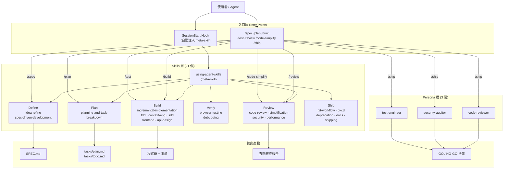
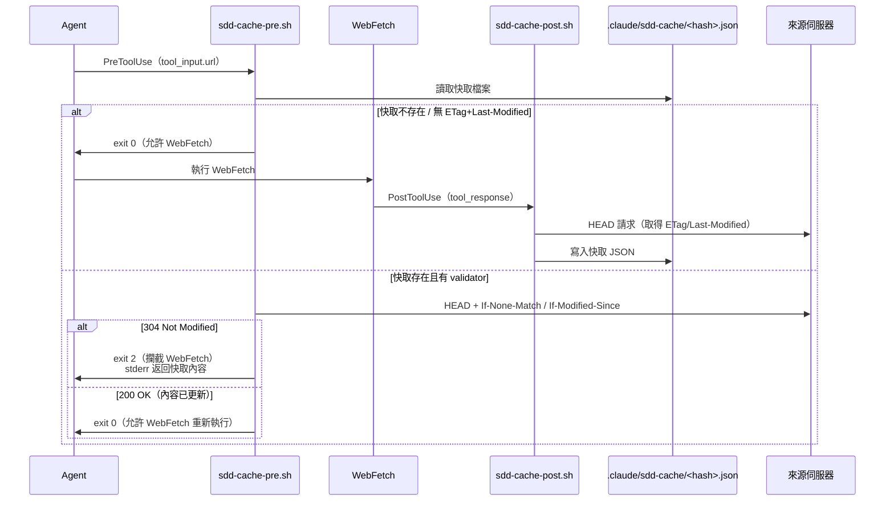

# API_SURFACE.md — agent-skills 公開介面參考

> 版本：1.0.0 | 維護者：Addy Osmani | 授權：MIT
> 
> 本文件涵蓋 agent-skills 的所有公開「介面」：Slash Commands、Skills 發現介面、Persona 介面、Hook 設定 API、Plugin Manifest 格式，以及 SDD Cache Hook 協定。

---

## 系統架構總覽



---

## 1. Slash Commands 完整參考（7 個）

| Command | Description（frontmatter 原文）| 觸發的 Skill / Persona | 主要輸出產物 |
|---------|-------------------------------|----------------------|------------|
| `/spec` | Start spec-driven development — write a structured specification before writing code | `spec-driven-development` | `SPEC.md`（專案根目錄） |
| `/plan` | Break work into small verifiable tasks with acceptance criteria and dependency ordering | `planning-and-task-breakdown` | `tasks/plan.md`、`tasks/todo.md` |
| `/build` | Implement the next task incrementally — build, test, verify, commit | `incremental-implementation` + `test-driven-development`（失敗時觸發 `debugging-and-error-recovery`） | 程式碼變更 + commit |
| `/test` | Run TDD workflow — write failing tests, implement, verify. For bugs, use the Prove-It pattern. | `test-driven-development`（browser 相關時附帶 `browser-testing-with-devtools`） | 測試檔案 + 驗證結果 |
| `/review` | Conduct a five-axis code review — correctness, readability, architecture, security, performance | `code-review-and-quality` | 結構化審查報告（含 file:line 引用） |
| `/code-simplify` | Simplify code for clarity and maintainability — reduce complexity without changing behavior | `code-simplification` | 重構後程式碼（行為不變） |
| `/ship` | Run the pre-launch checklist via parallel fan-out to specialist personas, then synthesize a go/no-go decision | `shipping-and-launch` + 並行派發 `code-reviewer`、`security-auditor`、`test-engineer` subagents | GO / NO-GO 決策報告 + Rollback 計畫 |

### `/ship` 輸出模板

```markdown
## Ship Decision: GO | NO-GO

### Blockers (must fix before ship)
- [Source persona: Critical finding + file:line]

### Recommended fixes (should fix before ship)
- [Source persona: Important finding + file:line]

### Acknowledged risks (shipping anyway)
- [Risk + mitigation]

### Rollback plan
- Trigger conditions: [what signals would prompt rollback]
- Rollback procedure: [exact steps]
- Recovery time objective: [target]

### Specialist reports (full)
- [code-reviewer report]
- [security-auditor report]
- [test-engineer report]
```

**`/ship` 跳過 fan-out 的條件**（三條件全滿足才可略過）：
1. 變更涉及 ≤ 2 個檔案
2. diff ≤ 50 行
3. 未觸及 auth、payments、data access 或 config/env

---

## 2. Skills 發現介面（21 個）

以開發生命週期階段排序。

### Define 階段

| Skill 名稱 | Description（frontmatter 原文）| 觸發條件 |
|-----------|-------------------------------|---------|
| `idea-refine` | Refines ideas iteratively. Refine ideas through structured divergent and convergent thinking. Use "idea-refine" or "ideate" to trigger. | 說出 "idea-refine" 或 "ideate" |
| `spec-driven-development` | Creates specs before coding. Use when starting a new project, feature, or significant change and no specification exists yet. Use when requirements are unclear, ambiguous, or only exist as a vague idea. | 需求模糊、啟動新功能、尚無 SPEC.md |

### Plan 階段

| Skill 名稱 | Description（frontmatter 原文）| 觸發條件 |
|-----------|-------------------------------|---------|
| `planning-and-task-breakdown` | Breaks work into ordered tasks. Use when you have a spec or clear requirements and need to break work into implementable tasks. Use when a task feels too large to start, when you need to estimate scope, or when parallel work is possible. | 有 spec 但尚無任務分解；任務感覺太大 |

### Build 階段

| Skill 名稱 | Description（frontmatter 原文）| 觸發條件 |
|-----------|-------------------------------|---------|
| `incremental-implementation` | Delivers changes incrementally. Use when implementing any feature or change that touches more than one file. Use when you're about to write a large amount of code at once, or when a task feels too big to land in one step. | 變更超過一個檔案；大量程式碼一次寫入 |
| `test-driven-development` | Drives development with tests. Use when implementing any logic, fixing any bug, or changing any behavior. Use when you need to prove that code works, when a bug report arrives, or when you're about to modify existing functionality. | 實作任何邏輯；修 bug；修改既有功能 |
| `context-engineering` | Optimizes agent context setup. Use when starting a new session, when agent output quality degrades, when switching between tasks, or when you need to configure rules files and context for a project. | 新 session 開始；agent 輸出品質下降 |
| `source-driven-development` | Grounds every implementation decision in official documentation. Use when you want authoritative, source-cited code free from outdated patterns. Use when building with any framework or library where correctness matters. | 使用 framework/library；需要 source-cited 程式碼 |
| `frontend-ui-engineering` | Builds production-quality UIs. Use when building or modifying user-facing interfaces. Use when creating components, implementing layouts, managing state, or when the output needs to look and feel production-quality rather than AI-generated. | 建立或修改 UI 元件；需要生產品質外觀 |
| `api-and-interface-design` | Guides stable API and interface design. Use when designing APIs, module boundaries, or any public interface. Use when creating REST or GraphQL endpoints, defining type contracts between modules, or establishing boundaries between frontend and backend. | 設計 API；定義模組邊界；REST/GraphQL endpoints |

### Verify 階段

| Skill 名稱 | Description（frontmatter 原文）| 觸發條件 |
|-----------|-------------------------------|---------|
| `browser-testing-with-devtools` | Tests in real browsers. Use when building or debugging anything that runs in a browser. Use when you need to inspect the DOM, capture console errors, analyze network requests, profile performance, or verify visual output with real runtime data via Chrome DevTools MCP. | 瀏覽器相關 debug；DOM 檢查；網路分析 |
| `debugging-and-error-recovery` | Guides systematic root-cause debugging. Use when tests fail, builds break, behavior doesn't match expectations, or you encounter any unexpected error. Use when you need a systematic approach to finding and fixing the root cause rather than guessing. | 測試失敗；build 中斷；行為不符預期 |

### Review 階段

| Skill 名稱 | Description（frontmatter 原文）| 觸發條件 |
|-----------|-------------------------------|---------|
| `code-review-and-quality` | Conducts multi-axis code review. Use before merging any change. Use when reviewing code written by yourself, another agent, or a human. Use when you need to assess code quality across multiple dimensions before it enters the main branch. | 合併前審查；多維度品質評估 |
| `code-simplification` | Simplifies code for clarity. Use when refactoring code for clarity without changing behavior. Use when code works but is harder to read, maintain, or extend than it should be. Use when reviewing code that has accumulated unnecessary complexity. | 程式碼可用但難讀；重構降低複雜度 |
| `security-and-hardening` | Hardens code against vulnerabilities. Use when handling user input, authentication, data storage, or external integrations. Use when building any feature that accepts untrusted data, manages user sessions, or interacts with third-party services. | 處理用戶輸入；auth；外部整合 |
| `performance-optimization` | Optimizes application performance. Use when performance requirements exist, when you suspect performance regressions, or when Core Web Vitals or load times need improvement. Use when profiling reveals bottlenecks that need fixing. | 有效能需求；Core Web Vitals 問題 |

### Ship 階段

| Skill 名稱 | Description（frontmatter 原文）| 觸發條件 |
|-----------|-------------------------------|---------|
| `git-workflow-and-versioning` | Structures git workflow practices. Use when making any code change. Use when committing, branching, resolving conflicts, or when you need to organize work across multiple parallel streams. | 任何 commit；branching；版本管理 |
| `ci-cd-and-automation` | Automates CI/CD pipeline setup. Use when setting up or modifying build and deployment pipelines. Use when you need to automate quality gates, configure test runners in CI, or establish deployment strategies. | 建立或修改 CI/CD；部署策略設計 |
| `deprecation-and-migration` | Manages deprecation and migration. Use when removing old systems, APIs, or features. Use when migrating users from one implementation to another. Use when deciding whether to maintain or sunset existing code. | 移除舊系統；API migration；決定是否 sunset |
| `documentation-and-adrs` | Records decisions and documentation. Use when making architectural decisions, changing public APIs, shipping features, or when you need to record context that future engineers and agents will need to understand the codebase. | 架構決策；API 變更；功能上線 |
| `shipping-and-launch` | Prepares production launches. Use when preparing to deploy to production. Use when you need a pre-launch checklist, when setting up monitoring, when planning a staged rollout, or when you need a rollback strategy. | 部署到 production；staged rollout；需要 rollback 計畫 |

### Meta

| Skill 名稱 | Description（frontmatter 原文）| 觸發條件 |
|-----------|-------------------------------|---------|
| `using-agent-skills` | Discovers and invokes agent skills. Use when starting a session or when you need to discover which skill applies to the current task. This is the meta-skill that governs how all other skills are discovered and invoked. | Session 開始（自動注入）；不知道用哪個 skill |

---

## 3. Persona 介面（3 個）

### 呼叫方式

```
# 直接呼叫（單一視角）
"Review this PR" → 呼叫 code-reviewer
"Are there security issues in auth.ts?" → 呼叫 security-auditor
"What tests are missing?" → 呼叫 test-engineer

# 並行 fan-out（/ship 使用）
→ 同時發出三個 Agent tool calls（Claude Code 的 subagent_type 欄位）
```

### Persona 概覽

| Persona | `name` 欄位 | 角色 | Description（frontmatter 原文）|
|---------|------------|------|-------------------------------|
| `code-reviewer` | `code-reviewer` | Senior Staff Engineer | Senior code reviewer that evaluates changes across five dimensions — correctness, readability, architecture, security, and performance. Use for thorough code review before merge. |
| `security-auditor` | `security-auditor` | Security Engineer | Security engineer focused on vulnerability detection, threat modeling, and secure coding practices. Use for security-focused code review, threat analysis, or hardening recommendations. |
| `test-engineer` | `test-engineer` | QA Specialist | QA engineer specialized in test strategy, test writing, and coverage analysis. Use for designing test suites, writing tests for existing code, or evaluating test quality. |

### code-reviewer 輸出格式

五軸審查（每軸分類：Critical / Important / Suggestion）：
1. **Correctness** — spec 符合度、edge cases、race conditions
2. **Readability** — 命名、控制流、組織結構
3. **Architecture** — 模式遵循、模組邊界、抽象層次
4. **Security** — 輸入驗證、secrets 處理、auth 檢查
5. **Performance** — N+1 查詢、無界操作

### security-auditor 輸出格式

六個審查面向：Input Handling、Authentication & Authorization、Data Protection、Infrastructure、Dependencies、Business Logic。風險等級：Critical / High / Medium / Low。

### test-engineer 輸出格式

覆蓋分析：Happy Path、Edge Cases、Error Paths、Concurrency Scenarios。附帶 Prove-It Pattern 應用（bug 修復場景：先寫出失敗測試再修復）。

### Persona 解析優先順序（Claude Code）

```
.claude/agents/<name>.md（project 層）
    > ~/.claude/agents/<name>.md（user 層）
        > Plugin 提供的 agents/<name>.md（最低優先）
```

---

## 4. Hook 設定 API

### hooks.json 格式規格

Hook 設定檔案路徑：`hooks/hooks.json`（plugin 內建）或 `.claude/settings.json` / `.claude/settings.local.json`（專案自訂）。

```json
{
  "hooks": {
    "<HookType>": [
      {
        "matcher": "<tool-name-pattern>",
        "hooks": [
          {
            "type": "command",
            "command": "<shell-command>",
            "timeout": 10,
            "async": false
          }
        ]
      }
    ]
  }
}
```

### 支援的 Hook 類型

| Hook 類型 | 觸發時機 | 典型用途 |
|----------|---------|---------|
| `SessionStart` | Agent session 啟動時 | 注入 meta-skill context |
| `PreToolUse` | 工具執行前 | 快取查詢、攔截請求 |
| `PostToolUse` | 工具執行後 | 儲存快取、非同步記錄 |

### Hook 設定欄位

| 欄位 | 類型 | 必填 | 說明 |
|------|------|------|------|
| `type` | `string` | 是 | 目前僅支援 `"command"` |
| `command` | `string` | 是 | 執行的 shell 指令；支援 `${CLAUDE_PLUGIN_ROOT}`、`${CLAUDE_PROJECT_DIR}` 環境變數 |
| `timeout` | `number` | 否 | 執行逾時秒數（預設：無限制，建議設 10） |
| `async` | `boolean` | 否 | `true` 表示非同步執行（不阻塞 agent）；預設 `false` |
| `matcher` | `string` | 否 | 工具名稱篩選器（PreToolUse / PostToolUse 用）；`SessionStart` 不使用此欄位 |

### Hook 退出碼語意

| 退出碼 | 語意 | 行為 |
|-------|------|------|
| `0` | 繼續（pass-through） | 允許工具正常執行 |
| `2` | 攔截（intercept） | 取消工具執行；stderr 輸出作為替代結果傳回 agent |
| 其他 | 錯誤 | 視同 `0`（graceful degradation） |

---

## 5. Plugin Manifest 格式

### plugin.json（`.claude-plugin/plugin.json`）

| 欄位 | 類型 | 必填 | 說明 |
|------|------|------|------|
| `name` | `string` | 是 | Plugin 識別名稱，例：`"agent-skills"` |
| `description` | `string` | 否 | Plugin 描述文字 |
| `version` | `string` | 是 | 語意化版本，例：`"1.0.0"` |
| `author.name` | `string` | 否 | 作者姓名 |
| `homepage` | `string` | 否 | 專案首頁 URL |
| `repository` | `string` | 否 | 原始碼儲存庫 URL |
| `license` | `string` | 否 | 授權類型，例：`"MIT"` |
| `commands` | `string` | 是 | Slash commands 目錄路徑，例：`"./.claude/commands"` |

### marketplace.json（`.claude-plugin/marketplace.json`）

| 欄位 | 類型 | 說明 |
|------|------|------|
| `name` | `string` | Marketplace 安裝識別碼，例：`"addy-agent-skills"` |
| `owner.name` | `string` | 套件擁有者名稱 |
| `metadata.description` | `string` | Marketplace 顯示描述 |
| `plugins[].name` | `string` | 對應 `plugin.json` 的 `name` 欄位 |
| `plugins[].source.source` | `string` | 來源類型，例：`"github"` |
| `plugins[].source.repo` | `string` | GitHub `owner/repo` 格式 |
| `plugins[].description` | `string` | 個別 plugin 的展示說明 |

### 安裝指令（Claude Code）

```bash
/plugin marketplace add addyosmani/agent-skills
/plugin install agent-skills@addy-agent-skills
```

---

## 6. SDD Cache Hook 協定

SDD Cache Hook 是 `source-driven-development` 技能的選用加速模組，透過 HTTP 條件式請求（Conditional GET）實現跨 session 的 WebFetch 快取。

### 架構流程



### PreToolUse 輸入格式（stdin JSON）

```json
{
  "tool_input": {
    "url": "https://example.com/docs/api",
    "prompt": "What is the authentication method?"
  }
}
```

| 欄位 | 說明 |
|------|------|
| `tool_input.url` | 目標 URL（快取鍵的基礎） |
| `tool_input.prompt` | 呼叫端的 prompt（儲存為 metadata，不參與快取鍵計算） |

### PostToolUse 輸入格式（stdin JSON）

```json
{
  "tool_input": {
    "url": "https://example.com/docs/api",
    "prompt": "What is the authentication method?"
  },
  "tool_response": {
    "result": "<WebFetch 返回的處理後內容>",
    "bytes": 12345,
    "code": 200,
    "durationMs": 850
  }
}
```

`tool_response` 內容欄位解析優先順序：`.result` → `.output` → `.text` → `.content` → `.body` → 字串形式。

### 快取條目格式（`.claude/sdd-cache/<hash>.json`）

```json
{
  "url": "https://example.com/docs/api",
  "prompt": "原始 WebFetch 的 prompt",
  "etag": "W/\"abc123\"",
  "last_modified": "Tue, 01 Jan 2026 00:00:00 GMT",
  "content": "WebFetch 返回的 model-processed 內容",
  "fetched_at": 1751808000
}
```

| 欄位 | 說明 |
|------|------|
| `url` | 完整 URL（人類可讀） |
| `prompt` | 產生此快取條目的原始 prompt（metadata） |
| `etag` | HTTP ETag 驗證器（來自 HEAD 回應） |
| `last_modified` | HTTP Last-Modified 驗證器（來自 HEAD 回應） |
| `content` | 快取的 WebFetch 回應內容（model-processed） |
| `fetched_at` | Unix timestamp（秒），紀錄寫入時間 |

### 快取鍵計算

```
key = sha256(url)[0:32]  # 截取 128-bit，hex 編碼
path = .claude/sdd-cache/<key>.json
```

### 快取命中 / 未命中行為

| 情境 | 行為 | 退出碼 |
|------|------|-------|
| 無快取檔案 | 允許 WebFetch 執行 | `0` |
| 快取無 ETag 且無 Last-Modified | bypass，允許 WebFetch | `0` |
| 304 Not Modified | 攔截 WebFetch，返回快取內容（stderr） | `2` |
| 非 304 回應 | 允許 WebFetch 重新執行 | `0` |
| curl / jq / shasum 不存在 | Graceful degradation，允許 WebFetch | `0` |
| 快取 content 欄位為空 | bypass，允許 WebFetch | `0` |

### 啟用方式（`.claude/settings.json`）

```json
{
  "hooks": {
    "PreToolUse": [
      {
        "matcher": "WebFetch",
        "hooks": [{ "type": "command", "command": "bash ${CLAUDE_PROJECT_DIR}/hooks/sdd-cache-pre.sh", "timeout": 10 }]
      }
    ],
    "PostToolUse": [
      {
        "matcher": "WebFetch",
        "hooks": [{ "type": "command", "command": "bash ${CLAUDE_PROJECT_DIR}/hooks/sdd-cache-post.sh", "async": true, "timeout": 10 }]
      }
    ]
  }
}
```

### 已知限制

- 每次快取讀取需額外發出一次 HEAD 請求（HTTP round-trip）
- 相同 URL 的不同 prompt 共用同一快取條目（prompt 僅作 metadata）
- 無 TTL；僅靠 HTTP 304 判斷新鮮度
- 無跨團隊共享快取機制

---

## 7. 多平台安裝指令對照表

| 平台 | 安裝指令 | Skills 自動發現 | Slash Commands | Personas | SessionStart Hook |
|------|---------|---------------|----------------|---------|-----------------|
| **Claude Code** | `/plugin marketplace add addyosmani/agent-skills`<br/>`/plugin install agent-skills@addy-agent-skills` | 自動（SessionStart） | 全部 7 個 | subagents | 支援 |
| **Gemini CLI** | `gemini skills install https://github.com/addyosmani/agent-skills.git --path skills` | 自動 | 不支援 | 不支援 | 不支援 |
| **Cursor** | `mkdir -p .cursor/rules && cp agent-skills/skills/*/SKILL.md .cursor/rules/` | 需手動複製 | 不支援 | 不支援 | 不支援 |
| **Windsurf** | 參閱 `docs/windsurf-setup.md` | 需手動設定 | 不支援 | 不支援 | 不支援 |
| **GitHub Copilot** | 參閱 `docs/copilot-setup.md`；SKILL.md → `.github/copilot-instructions.md` | 需手動設定 | 不支援 | 部分支援 | 不支援 |
| **OpenCode** | `AGENTS.md` 意圖映射（內建） | 自動（`skill` tool） | 不支援（用意圖映射替代） | 部分支援 | 不支援 |
| **Kiro IDE** | 複製至 `.kiro/skills/`（Project 或 Global 層級） | 未驗證 | 不支援 | 不支援 | 不支援 |

---

*產出時間：2026-04-25 | 資料來源：`.trace/_context/recon.md`、`entry_points.md`、`integrations.md` 及原始碼直接讀取*
