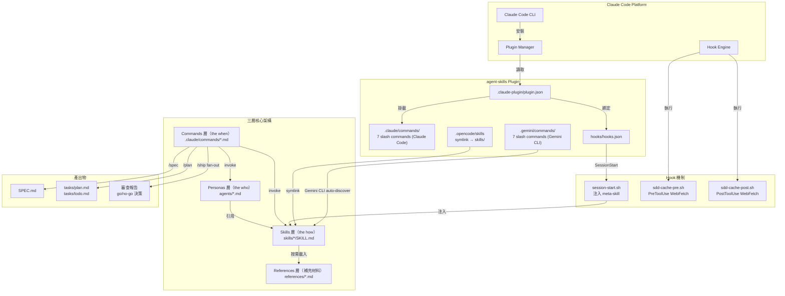
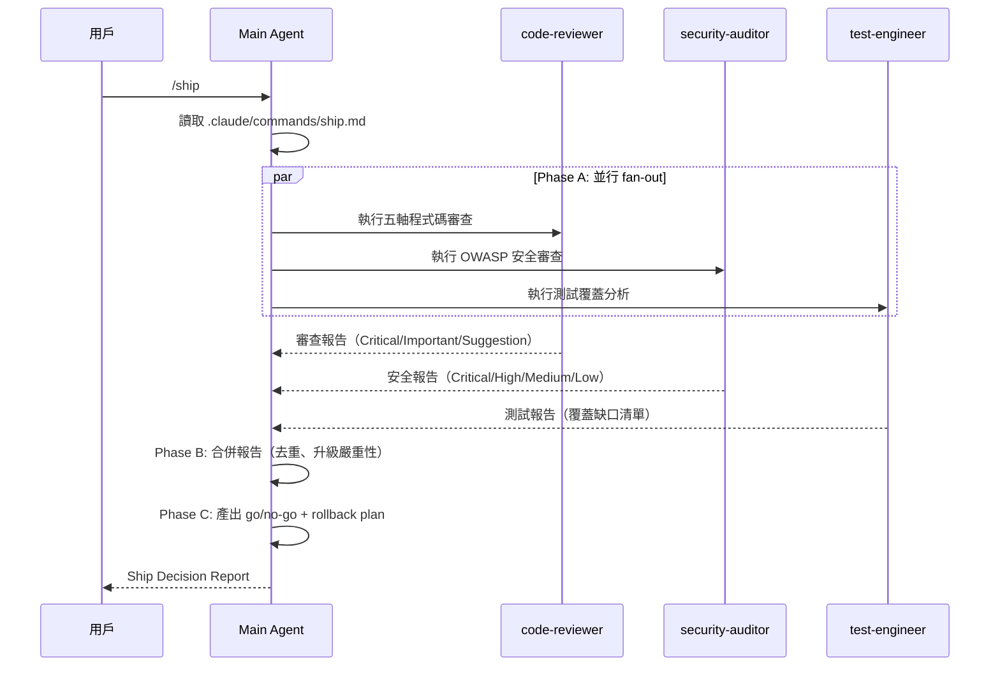

# 系統架構

## 高層架構

**agent-skills** 是一個純文件型 plugin，其「架構」是 **Markdown 文件 + Bash hooks + JSON manifest** 的組合，透過 Claude Code Plugin 協定整合到 AI agent 的執行環境。



## 組件清單

| 組件 | 職責 | 關鍵檔案/目錄 | 上游依賴 | 下游依賴 |
|------|------|-------------|---------|---------|
| Plugin Manifest | 宣告 plugin 名稱、版本、commands 路徑 | `.claude-plugin/plugin.json` | Claude Code Plugin Manager | Commands 層 |
| Marketplace Manifest | Marketplace 安裝識別 | `.claude-plugin/marketplace.json` | Claude Code Marketplace | Plugin Manifest |
| Gemini CLI Commands | Gemini CLI 原生 slash commands（TOML 格式） | `.gemini/commands/*.toml` | Gemini CLI auto-discovery | Skills 層 |
| OpenCode Skills Symlink | 讓 OpenCode 自動發現 skills/（symlink） | `.opencode/skills` | OpenCode skill tool | Skills 層 |
| SessionStart Hook | 每個 session 自動注入 meta-skill | `hooks/session-start.sh`, `hooks/hooks.json` | Claude Code Hook Engine | Skills 層（using-agent-skills） |
| Meta-Skill | 技能發現導覽 flowchart + Core Operating Behaviors | `skills/using-agent-skills/SKILL.md` | SessionStart Hook | 所有 Skills |
| Skills 層 | 21 個工程工作流程（核心） | `skills/*/SKILL.md` | Commands 層、Personas 層 | References 層 |
| Personas 層 | 3 個 specialist agent 角色 | `agents/*.md` | Commands 層（/ship） | Skills 層 |
| Commands 層 | 7 個用戶觸發的工作流入口 | `.claude/commands/*.md` | 用戶輸入 | Skills 層、Personas 層 |
| References 層 | 按需載入的補充 checklist | `references/*.md` | Skills 層 | — |
| SDD Cache Hook | WebFetch HTTP ETag 快取（選用） | `hooks/sdd-cache-pre.sh`, `sdd-cache-post.sh` | PreToolUse/PostToolUse 事件 | `.claude/sdd-cache/` |
| CI/CD | Plugin 結構驗證與安裝測試 | `.github/workflows/test-plugin-install.yml` | GitHub Actions | npm(@anthropic-ai/claude-code) |

## 分層設計

### 三層架構原則（`agents/README.md`）

```
Layer       | What it is                        | Example              | Role
------------|-----------------------------------|----------------------|------------------
Skills      | workflow with steps & exit criteria | code-review-and-quality | The HOW（mandatory）
Personas    | role with perspective & output format | code-reviewer       | The WHO（perspective）
Commands    | user-facing entry point           | /review, /ship       | The WHEN（orchestration）
```

**關鍵規則**：用戶（或 slash command）是 orchestrator。Personas **不呼叫其他 Personas**。Skills 是 mandatory hops。

### Skills 層（21 個技能，6 個階段）

```
DEFINE       PLAN          BUILD              VERIFY          REVIEW              SHIP
─────────    ─────────     ──────────────     ──────────      ───────────────     ──────────────────
idea-refine  planning-and  incremental-       browser-        code-review-        git-workflow-and-
spec-driven  task-break    implementation     testing-with    and-quality         versioning
development  down          test-driven-dev    devtools        code-simplif-       ci-cd-and-
                           context-engineer   debugging-      ication             automation
                           source-driven-dev  and-error-      security-and-       deprecation-and-
                           frontend-ui-eng    recovery        hardening           migration
                           api-and-interface                  performance-        documentation-
                           design                             optimization        and-adrs
                                                                                  shipping-and-
                                                                                  launch
```

### References 層（5 個補充 checklist）

按需載入，不預載（Progressive disclosure 原則）：
- `testing-patterns.md` ← test-driven-development
- `security-checklist.md` ← security-and-hardening, code-review-and-quality
- `performance-checklist.md` ← performance-optimization, code-review-and-quality
- `accessibility-checklist.md` ← frontend-ui-engineering
- `orchestration-patterns.md` ← agents/, /ship command

## 通訊模式

### 1. Sequential Pipeline（用戶主導）

最常見模式，用戶依序執行 slash commands，每步驟有人類確認：

```
/spec → /plan → /build → /test → /review → /ship
```

無 orchestrator agent，用戶本身就是 orchestrator。這避免了 LLM 在步驟間摘要造成的資訊損失。

### 2. Parallel Fan-Out（`/ship` 專用）

唯一的多 persona 並行模式：



**限制**：sub-agents 不能呼叫其他 sub-agents（Claude Code 平台強制），防止無限遞迴。

### 3. Hook Injection（SessionStart 自動注入）

```
Session 開始 → session-start.sh 執行
→ 檢查 jq 是否可用（若無：輸出 INFO 訊息，exit 0，graceful fallback）
→ 讀取 using-agent-skills/SKILL.md
→ jq -cn --arg message "..." 正確 escape JSON（修復 19e49a0）
→ 輸出 {"priority": "IMPORTANT", "message": "..."} → 注入 agent context
```

<!-- 更新於 2026-04-30，commit range: 1f66d57..19e49a0 -->
**session-start.sh Bug Fix（`43a0dde` + `501d226`）**：
- 舊版以 heredoc 直接插入 `$CONTENT`，若 SKILL.md 含 `"` 或 `\` 則產生無效 JSON（JSON injection 風險）
- 新版改用 `jq -cn --arg message` 確保正確 escape
- 新增 jq 存在性檢查：若 jq 未安裝，輸出友善 INFO 訊息並允許 session 繼續（不中斷）
<!-- 更新結束 -->

### 4. Progressive Disclosure（按需載入）

Skills 的 `description` 欄位（≤1024 字元）作為「目錄」注入 system prompt。完整 SKILL.md 只在 agent 判斷技能適用時才載入。Reference 文件只在 skill 明確引用時才讀取。

### 5. HTTP Cache（SDD Cache Hook，選用）

```
WebFetch(url) → PreToolUse hook → HEAD 請求（ETag 驗證）
→ 304: 攔截 WebFetch，返回快取（exit 2）
→ 200: 允許 WebFetch，PostToolUse 儲存新快取
```

## 關鍵設計決策與 Trade-off

### 決策 1：Markdown 而非程式碼

**決策**：所有技能以 Markdown 撰寫，而非 Python/TypeScript。

**Rationale**：技能需要跨平台運作（Claude Code、Cursor、Gemini CLI 等），純 Markdown 讓任何接受 system prompt 的 agent 都能使用，無需 runtime 依賴。

**Trade-off**：無法用程式碼強制執行技能步驟，依賴 agent 遵守；但這本身也是設計意圖——技能是「工作流程指引」而非「執行引擎」。

### 決策 2：Anti-Rationalization 表格

**決策**：每個 skill 都包含「Common Rationalizations」表格，列出 agent 可能用來跳過步驟的藉口與反駁。

**Rationale**（`README.md`）：*"AI coding agents default to the shortest path — which often means skipping specs, tests, security reviews."* Anti-rationalization 表格是這個問題的直接對策。

**Trade-off**：增加每個 SKILL.md 的長度（token 消耗），但防止 agent 自我合理化是核心價值主張。

### 決策 3：Progressive Disclosure vs 全部預載

**決策**：`description` 欄位（1024 字元）作為技能發現介面；完整 SKILL.md 按需載入；Reference 文件更進一步延遲載入。

**Rationale**：減少每個 session 的 token 消耗。21 個 SKILL.md 共約 6,000 行，全部預載會耗盡 context。

**Trade-off**：Agent 必須先讀到 description 才能決定是否載入完整技能，初次發現有輕微延遲。

### 決策 4：Sub-agents 不能呼叫 Sub-agents

**決策**：明確禁止 persona 呼叫其他 persona（架構原則 + 平台限制）。

**Rationale**（`agents/README.md`）：避免「路由 meta-agent 反模式」—— 一個決定呼叫哪個 persona 的 agent 只是純路由，無 domain 價值，且增加 2 倍 token 消耗（via 摘要轉述）。

**Trade-off**：`/ship` 的 fan-out 必須在 main agent 完成，而非自動化 pipeline。

### 決策 5：用戶是 Orchestrator（Sequential Pipeline）

**決策**：`/spec → /plan → /build → ...` 的生命週期序列不自動化，由用戶逐步觸發。

**Rationale**：每個步驟之間的人類確認有價值——可以及早發現方向錯誤，避免在錯誤方向上投入大量工作。LLM orchestrator 在步驟間摘要時會損失資訊。

**Trade-off**：對熟練用戶而言較繁瑣，但對新用戶而言是清晰的心智模型。
