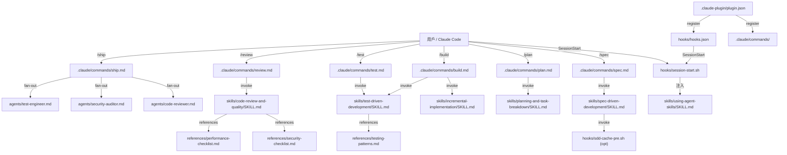

# 程式碼地圖

## Annotated Directory Tree

```
agent-skills/
│
├── skills/                            ← 【核心】21 個工程技能，每個一個目錄
│   ├── using-agent-skills/            ← Meta-skill：技能發現導覽（每次 session 自動注入）
│   │   └── SKILL.md                   ← 含技能選擇 flowchart + 6 個 Core Operating Behaviors
│   │
│   ├── ── Define 階段 ──
│   ├── idea-refine/                   ← 發散/收斂思考，精煉模糊想法
│   │   ├── SKILL.md                   ← 含 Apple 設計哲學引言
│   │   └── scripts/idea-refine.sh     ← 建立 docs/ideas/ 目錄的輔助腳本
│   ├── spec-driven-development/       ← 最嚴格的 gated workflow，寫 SPEC.md
│   │   └── SKILL.md
│   │
│   ├── ── Plan 階段 ──
│   ├── planning-and-task-breakdown/   ← 分解 SPEC.md 為 tasks/plan.md + tasks/todo.md
│   │   └── SKILL.md
│   │
│   ├── ── Build 階段 ──
│   ├── incremental-implementation/    ← 垂直切片實作，~100 行一個 commit
│   │   └── SKILL.md
│   ├── test-driven-development/       ← Red-Green-Refactor + Prove-It pattern
│   │   └── SKILL.md
│   ├── context-engineering/           ← 最佳化 agent 的 context 載入
│   │   └── SKILL.md
│   ├── source-driven-development/     ← 從官方文件驗證，搭配 SDD cache hook
│   │   └── SKILL.md
│   ├── frontend-ui-engineering/       ← 元件架構、WCAG 2.1 AA、設計系統
│   │   └── SKILL.md
│   ├── api-and-interface-design/      ← Contract-first、Hyrum's Law、One-Version Rule
│   │   └── SKILL.md
│   │
│   ├── ── Verify 階段 ──
│   ├── browser-testing-with-devtools/ ← Chrome DevTools MCP 整合
│   │   └── SKILL.md
│   ├── debugging-and-error-recovery/  ← 5 步驟 triage：reproduce → localize → reduce → fix → guard
│   │   └── SKILL.md
│   │
│   ├── ── Review 階段 ──
│   ├── code-review-and-quality/       ← 五軸審查（Correctness/Readability/Architecture/Security/Performance）
│   │   └── SKILL.md
│   ├── code-simplification/           ← Chesterton's Fence，Rule of 500
│   │   └── SKILL.md
│   ├── security-and-hardening/        ← OWASP Top 10，三層邊界系統
│   │   └── SKILL.md
│   ├── performance-optimization/      ← Measure-first，Core Web Vitals targets
│   │   └── SKILL.md
│   │
│   └── ── Ship 階段 ──
│       ├── git-workflow-and-versioning/   ← Trunk-based dev，atomic commits，~100 行/change
│       │   └── SKILL.md
│       ├── ci-cd-and-automation/          ← Shift Left，feature flags，quality gate pipeline
│       │   └── SKILL.md
│       ├── deprecation-and-migration/     ← Code as liability，compulsory vs advisory deprecation
│       │   └── SKILL.md
│       ├── documentation-and-adrs/        ← ADR 格式，API 文件標準
│       │   └── SKILL.md
│       └── shipping-and-launch/           ← Pre-launch checklist，staged rollout，rollback plan
│           └── SKILL.md
│
├── agents/                            ← 3 個 specialist personas（以角色視角產出報告）
│   ├── README.md                      ← 三層架構解說（Skills/Personas/Commands）+ 決策矩陣
│   ├── code-reviewer.md               ← Staff Engineer：五軸審查 + APPROVE/REQUEST CHANGES 模板
│   ├── security-auditor.md            ← Security Engineer：OWASP Top 10 + 嚴重性分類
│   └── test-engineer.md               ← QA Specialist：Prove-It pattern + 測試策略
│
├── hooks/                             ← Session lifecycle hooks（Bash 腳本）
│   ├── hooks.json                     ← SessionStart hook 設定（Plugin 全局）
│   ├── session-start.sh               ← 注入 using-agent-skills meta-skill
│   ├── sdd-cache-pre.sh               ← PreToolUse WebFetch：HTTP ETag 驗證快取
│   ├── sdd-cache-post.sh              ← PostToolUse WebFetch：儲存快取條目
│   ├── SDD-CACHE.md                   ← SDD cache 完整說明（含測試方式）
│   ├── simplify-ignore.sh             ← 設定 code-simplification 豁免清單
│   ├── simplify-ignore-test.sh        ← 測試腳本
│   └── SIMPLIFY-IGNORE.md             ← simplify-ignore 說明
│
├── .claude/commands/                  ← 7 個 Claude Code slash commands
│   ├── spec.md                        ← /spec
│   ├── plan.md                        ← /plan
│   ├── build.md                       ← /build（TDD + incremental-implementation 組合）
│   ├── test.md                        ← /test
│   ├── review.md                      ← /review
│   ├── code-simplify.md               ← /code-simplify
│   └── ship.md                        ← /ship（並行 fan-out 編排）
│
├── .claude-plugin/                    ← Claude Code Plugin 元資料
│   ├── plugin.json                    ← 名稱、版本、author、commands 路徑
│   └── marketplace.json              ← Marketplace 識別碼 addy-agent-skills
│
├── references/                        ← 補充 checklist（技能按需引用）
│   ├── testing-patterns.md            ← test-driven-development 補充（Arrange/Act/Assert 等）
│   ├── security-checklist.md          ← security-and-hardening 補充
│   ├── performance-checklist.md       ← performance-optimization 補充（Core Web Vitals）
│   ├── accessibility-checklist.md     ← frontend-ui-engineering 補充（WCAG）
│   └── orchestration-patterns.md     ← agents/ 設計補充（5 種編排模式 + 反模式）
│
├── docs/                              ← 各平台安裝指南
│   ├── skill-anatomy.md               ← 【重要】SKILL.md 格式規格（貢獻者必讀）
│   ├── getting-started.md             ← 通用上手指南
│   ├── cursor-setup.md                ← Cursor 設定
│   ├── gemini-cli-setup.md            ← Gemini CLI 設定
│   ├── windsurf-setup.md              ← Windsurf 設定
│   ├── copilot-setup.md               ← GitHub Copilot 設定
│   └── opencode-setup.md              ← OpenCode 設定
│
├── .github/workflows/
│   └── test-plugin-install.yml        ← CI：validate → install 兩步驟驗證
│
├── CLAUDE.md                          ← Claude Code 專案說明（技能名稱、格式規範）
├── AGENTS.md                          ← OpenCode 整合說明（含 SKILL.md OpenCode 格式）
├── README.md                          ← 主文件（20 個技能說明 + 安裝方式）
├── CONTRIBUTING.md                    ← 貢獻指南（品質標準 + 禁止事項）
├── LICENSE                            ← MIT License（版權 Addy Osmani 2025）
└── .gitignore                         ← 排除 .DS_Store, node_modules, .env, sdd-cache/, simplify-cache/
```

## 「我想改 X 要看哪裡？」速查表

| 我想要...                              | 看這裡                              | 關鍵檔案 |
|---------------------------------------|-------------------------------------|---------|
| 新增一個 Skill                         | `skills/<new-name>/`                | `SKILL.md`（格式參考 `docs/skill-anatomy.md`） |
| 修改現有 Skill 的工作流程               | `skills/<skill-name>/SKILL.md`      | 對應技能的 SKILL.md |
| 更新技能發現 flowchart                  | `skills/using-agent-skills/SKILL.md` | 第 20-45 行左右 |
| 新增 slash command                    | `.claude/commands/`                 | 新建 `<name>.md` |
| 修改 `/ship` 的 fan-out 邏輯           | `.claude/commands/ship.md`          | 整個 `ship.md` |
| 新增 agent persona                    | `agents/`                           | 新建 `<role>.md` |
| 修改 code-reviewer 的審查標準          | `agents/code-reviewer.md`           | Five-Axis Review 段落 |
| 調整 SessionStart 注入行為             | `hooks/session-start.sh`            | `session-start.sh` 全檔 |
| 啟用/修改 SDD cache 行為              | `hooks/sdd-cache-pre.sh` / `sdd-cache-post.sh` | hook 邏輯 |
| 更新 plugin 版本號                     | `.claude-plugin/plugin.json`        | `version` 欄位 |
| 新增安全 checklist 項目                | `references/security-checklist.md` | 對應區塊 |
| 新增測試 pattern                      | `references/testing-patterns.md`   | 對應區塊 |
| 新增平台支援文件                        | `docs/<platform>-setup.md`         | 新建文件 + README 更新 |
| 修改 CI 驗證流程                       | `.github/workflows/test-plugin-install.yml` | 整個 YAML |
| 修改貢獻規範                           | `CONTRIBUTING.md`                   | 對應段落 |
| 修改 OpenCode 整合行為                 | `AGENTS.md`                         | Intent → Skill Mapping 段落 |

## 模組依賴關係圖



## 重要技能關係

| 技能 | 前置技能 | 後置技能 | 補充 Reference |
|------|---------|---------|---------------|
| idea-refine | — | spec-driven-development | — |
| spec-driven-development | idea-refine（選用） | planning-and-task-breakdown | — |
| planning-and-task-breakdown | spec-driven-development | incremental-implementation | — |
| incremental-implementation | planning-and-task-breakdown | code-review-and-quality | — |
| test-driven-development | （任何實作技能） | code-review-and-quality | testing-patterns.md |
| code-review-and-quality | incremental-implementation | git-workflow-and-versioning | security-checklist.md, performance-checklist.md |
| security-and-hardening | code-review-and-quality | shipping-and-launch | security-checklist.md |
| shipping-and-launch | code-review-and-quality | — | — |
