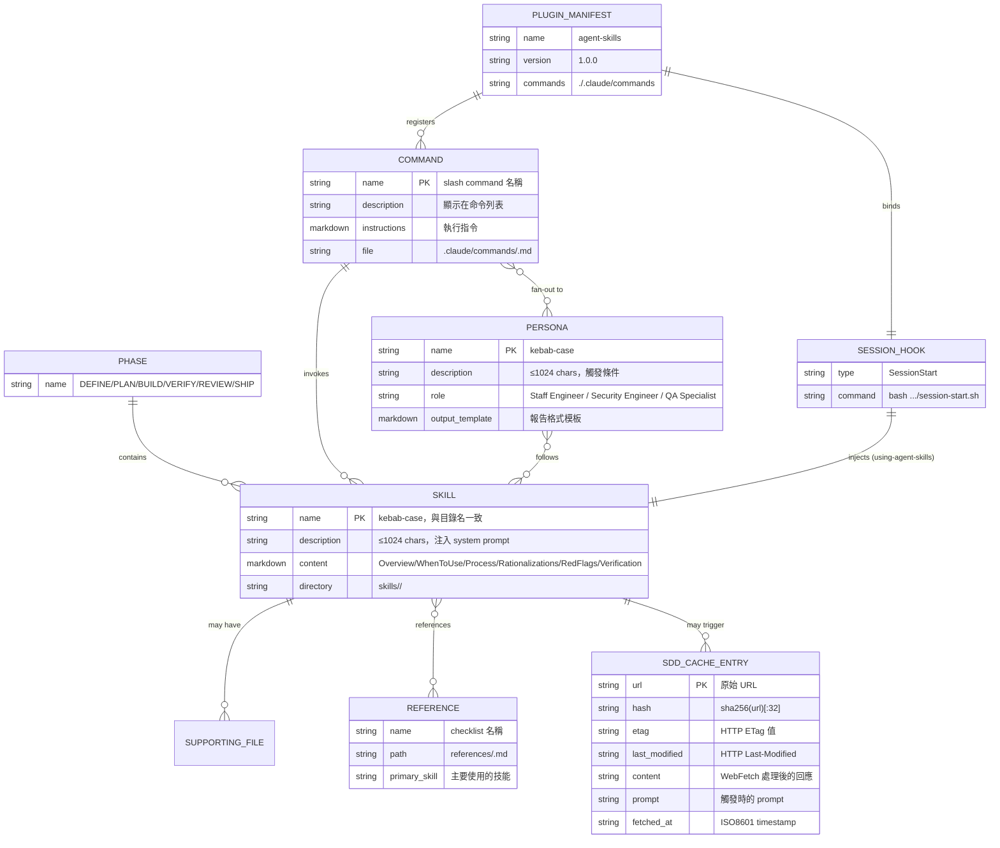

# 資料模型

## 概述

本專案為純文件型 plugin，無資料庫。「資料模型」指各類文件的結構規格、欄位定義，以及它們之間的概念關係。

## 概念 ER 圖



## SKILL.md 結構

**格式規格來源**：`docs/skill-anatomy.md`

### Frontmatter（必填）

```yaml
---
name: skill-name-with-hyphens    # 必填，kebab-case，必須與目錄名稱完全一致
description: |                   # 必填，≤1024 字元
  Guides agents through [task/workflow].
  Use when [specific trigger conditions].
---
```

**規則**：
- `name`：全小寫，以 `-` 分隔，必須等於目錄名
- `description`：第三人稱描述技能做什麼，然後附 "Use when" 觸發條件。**禁止**包含流程步驟（否則 agent 執行摘要而跳過完整 SKILL.md）

### 標準段落（建議順序）

| 段落 | 目的 | 長度建議 |
|------|------|---------|
| `# Title` | 技能標題 | 1 行 |
| `## Overview` | 1-2 句說明技能做什麼及為何重要 | ≤3 句 |
| `## When to Use` | 觸發條件 + 排除條件（bullet list） | ≤10 條 |
| `## [Core Process]` | 主要工作流程，numbered steps | 技能核心，通常最長 |
| `## Common Rationalizations` | Excuse→Reality 對照表（Markdown table） | 3-8 條 |
| `## Red Flags` | 違反技能的警告信號（bullet list） | 3-8 條 |
| `## Verification` | 完成標準 checkbox（需可見証據） | 3-10 個 checkbox |

### 完整範例（`spec-driven-development` frontmatter）

```yaml
---
name: spec-driven-development
description: Creates specs before coding. Use when starting a new project,
  feature, or significant change and no specification exists yet. Use when
  requirements are unclear, ambiguous, or only exist as a vague idea.
---
```

### Supporting Files 規則

- 只在 SKILL.md 超過 100 行時建立 supporting files
- Supporting files 放在與 SKILL.md 相同目錄
- Reference 材料（>50 行的 checklist）放 `references/`，不放技能目錄

目前唯一有 scripts/ 的技能：`skills/idea-refine/scripts/idea-refine.sh`（建立 `docs/ideas/` 目錄）

## Persona 結構

**位置**：`agents/<role>.md`

```yaml
---
name: code-reviewer              # kebab-case，作為 subagent_type 使用
description: Senior code reviewer that evaluates changes across five dimensions...
             Use for thorough code review before merge.
---
```

### 必要段落

| 段落 | 內容 |
|------|------|
| 角色宣告 | "You are [role]..." |
| Review Scope / Framework | 角色的評估維度 |
| Output Format | 嚴重性分類（Critical/Important/Suggestion） |
| Output Template | Markdown 報告模板（含 verdict 欄位） |
| Composition | 何時直接呼叫 vs 透過 command，不從其他 persona 呼叫 |

### 三個 Persona 的輸出模板

**code-reviewer** 輸出：
```markdown
## Review Summary
**Verdict:** APPROVE | REQUEST CHANGES
### Critical Issues / Important Issues / Suggestions / What's Done Well / Verification Story
```

**security-auditor** 輸出：
```markdown
## Security Audit Report
**Risk Level:** CRITICAL | HIGH | MEDIUM | LOW | INFORMATIONAL
### Findings by Severity / Recommended Mitigations
```

**test-engineer** 輸出：
```markdown
## Test Coverage Analysis
### Coverage Gaps / Missing Test Scenarios / Recommended Tests
```

## Slash Command 結構

**位置**：`.claude/commands/<name>.md`

```yaml
---
description: Brief one-line description shown in command list  # 必填
---

# Command instructions (Markdown body)
...
```

### 7 個 Commands 的 description

| Command | description |
|---------|-------------|
| `/spec` | Start spec-driven development — write a structured specification before writing code |
| `/plan` | Break work into small verifiable tasks with acceptance criteria and dependency ordering |
| `/build` | Implement the next task incrementally — build, test, verify, commit |
| `/test` | Run TDD workflow — write failing tests, implement, verify. For bugs, use the Prove-It pattern. |
| `/review` | Conduct a five-axis code review — correctness, readability, architecture, security, performance |
| `/code-simplify` | Simplify code for clarity and maintainability — reduce complexity without changing behavior |
| `/ship` | Run the pre-launch checklist via parallel fan-out to specialist personas, then synthesize a go/no-go decision |

## Plugin Manifest 結構

### `plugin.json`（`.claude-plugin/plugin.json`）

```json
{
  "name": "agent-skills",          // Plugin 識別名稱
  "description": "...",            // 簡短描述
  "version": "1.0.0",             // 語意化版本
  "author": { "name": "Addy Osmani" },
  "homepage": "https://github.com/addyosmani/agent-skills",
  "repository": "https://github.com/addyosmani/agent-skills",
  "license": "MIT",
  "commands": "./.claude/commands" // slash commands 目錄路徑
}
```

### `marketplace.json`（`.claude-plugin/marketplace.json`）

```json
{
  "name": "addy-agent-skills",     // Marketplace 安裝識別碼（注意：與 plugin.json 的 name 不同）
  "owner": { "name": "Addy Osmani" },
  "metadata": { "description": "..." },
  "plugins": [{
    "name": "agent-skills",        // 對應 plugin.json 的 name
    "source": {
      "source": "github",          // 來源類型
      "repo": "addyosmani/agent-skills"
    },
    "description": "..."
  }]
}
```

**注意**：安裝指令 `/plugin install agent-skills@addy-agent-skills` 中，`agent-skills` 是 plugin name，`addy-agent-skills` 是 marketplace name。

## Hook 設定結構

### `hooks.json`（`hooks/hooks.json`）

```json
{
  "hooks": {
    "SessionStart": [{              // Hook 類型（SessionStart/PreToolUse/PostToolUse）
      "hooks": [{
        "type": "command",          // 目前唯一支援的 type
        "command": "bash ${CLAUDE_PLUGIN_ROOT}/hooks/session-start.sh"
      }]
    }]
  }
}
```

### PreToolUse/PostToolUse Hook 欄位

| 欄位 | 類型 | 說明 |
|------|------|------|
| `type` | string | 固定為 `"command"` |
| `command` | string | 要執行的 shell 指令 |
| `matcher` | string | 工具名稱 pattern（如 `"WebFetch"`） |
| `timeout` | number | 超時秒數 |
| `async` | boolean | 是否異步執行（PostToolUse 用） |

## SDD Cache Entry 結構

**位置**：`.claude/sdd-cache/<sha256(url)[:32]>.json`

```json
{
  "url": "https://react.dev/reference/...",  // 原始 URL（快取鍵的來源）
  "prompt": "extract the signature",          // 觸發 WebFetch 時的 prompt
  "etag": "W/\"abc123\"",                    // HTTP ETag（用於 304 驗證）
  "last_modified": "Tue, 01 Jan 2026 ...",  // HTTP Last-Modified（備用驗證）
  "content": "useActionState(...)",          // WebFetch 處理後的回應（prompt-shaped）
  "fetched_at": "2026-01-01T00:00:00Z"      // ISO8601 時間戳
}
```

**快取不建立條件**：伺服器未回傳 `ETag` 或 `Last-Modified` header。

## Skill 生命週期

```
建立（開發者）
    ├── mkdir skills/<name>/
    ├── 撰寫 SKILL.md（frontmatter + 標準段落）
    └── 更新 using-agent-skills/SKILL.md flowchart

發布（CI/CD）
    ├── git push → GitHub Actions
    ├── claude plugin validate .（驗證 manifest 結構）
    └── claude plugin install（端對端安裝測試）

消費（agent 執行時）
    ├── SessionStart → session-start.sh 注入 using-agent-skills
    ├── Agent 讀取 description 發現適用技能
    ├── 載入完整 SKILL.md 到 context
    ├── 執行 Process 步驟（步驟順序強制）
    ├── 按需載入 references/（超過 skill 範圍時）
    └── 執行 Verification checklist（必須有可見証據）

淘汰（未來）
    └── 目前無版本化或淘汰機制（⚠️ 已知技術債）
```
