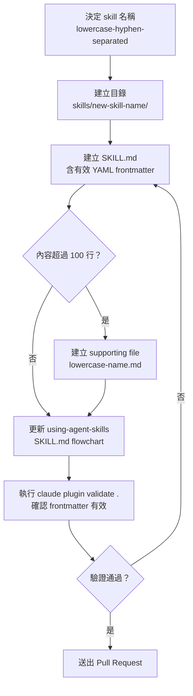
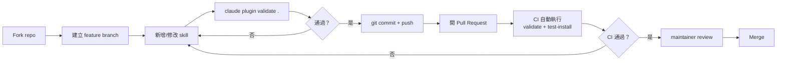

# agent-skills 開發者上手指南

> 適用對象：想要為 agent-skills 貢獻新 skill、修改現有內容、或在本地測試 plugin 行為的開發者。

---

## 目錄

1. [Prerequisites](#1-prerequisites)
2. [本地開發 Workflow](#2-本地開發-workflow)
3. [新增 Skill 的 Step-by-Step](#3-新增-skill-的-step-by-step)
4. [測試策略](#4-測試策略)
5. [Debugging 技巧](#5-debugging-技巧)
6. [Contribution Workflow](#6-contribution-workflow)
7. [常見踩坑](#7-常見踩坑)

---

## 1. Prerequisites

### 貢獻者（想要開發或修改 skills）

| 工具 | 版本需求 | 用途 |
|------|---------|------|
| `git` | 任意版本 | Clone 與版本管理 |
| `bash` | 3.2+ | 執行 hook 腳本 |
| `jq` | 任意版本 | SDD cache hook 執行（可選，但缺少則 cache 功能不可用） |
| `curl` | 任意版本 | SDD cache hook 的 HTTP revalidation |
| `shasum` 或 `sha256sum` | 任意版本 | SDD cache key 計算（兩者自動偵測） |
| `node` + `npm` | Node 18+ | 安裝 Claude Code CLI 進行 plugin 驗證 |

### 使用者（只想在 AI agent 中使用 skills）

| 工具 | 用途 |
|------|------|
| Claude Code CLI | 原生 Plugin 支援（slash commands、hooks） |
| Cursor | 透過 `.cursor/rules/` 或 `.cursorrules` 載入 |
| Gemini CLI | `gemini skills install` |
| Windsurf | rules 設定 |
| GitHub Copilot | `.github/copilot-instructions.md` |
| OpenCode | `AGENTS.md` + skill tool |

---

## 2. 本地開發 Workflow

### Clone 並設定 plugin-dir

```bash
git clone https://github.com/addyosmani/agent-skills.git
cd agent-skills
```

### 以本地目錄啟動 Claude Code（plugin 測試模式）

```bash
# 使用 --plugin-dir 指向本地 clone 的目錄
claude --plugin-dir /path/to/agent-skills
```

這會讓 Claude Code 從本地目錄讀取 `.claude-plugin/plugin.json`、hooks 和 slash commands，不需要發布到 marketplace。

### 驗證 plugin 結構

```bash
# 安裝 Claude Code CLI（若尚未安裝）
npm install -g @anthropic-ai/claude-code

# 驗證 plugin.json 與 marketplace.json 格式
claude plugin validate .
```

成功輸出範例：
```
✓ plugin.json valid
✓ marketplace.json valid
✓ commands directory found
```

### Plugin 安裝識別碼說明

`plugin.json` 中的 `name` 是 `"agent-skills"`，但 marketplace 安裝識別碼帶前綴：

```bash
# 正式安裝指令
claude plugin install agent-skills@addy-agent-skills --scope user
```

---

## 3. 新增 Skill 的 Step-by-Step

### 步驟概覽



### Step 1：建立目錄

```bash
mkdir skills/your-skill-name
```

命名規則：全小寫，以 `-` 分隔，與技能功能直接對應。

### Step 2：建立 SKILL.md

```bash
touch skills/your-skill-name/SKILL.md
```

**必要的 YAML frontmatter：**

```yaml
---
name: your-skill-name
description: Guides agents through [具體工作流程]. Use when [明確觸發條件].
---
```

注意事項：
- `name` 必須與目錄名完全一致
- `description` 最多 **1024 字元**（超過會導致 plugin validate 失敗）
- description 先說「做什麼」（第三人稱），再說「何時用」（Use when...）

**標準段落結構：**

```markdown
# Skill 標題

## Overview
一到兩句說明此技能的用途與重要性。

## When to Use
- 觸發條件（症狀、任務類型）
- NOT for：不適用情境

## [Core Process / The Workflow]
主要工作流程，用有編號的步驟或階段呈現。

## Common Rationalizations
| Rationalization | Reality |
|---|---|
| Agent 用來跳過步驟的藉口 | 反駁理由 |

## Red Flags
- Agent 違反此技能的行為警訊

## Verification
完成後確認：
- [ ] 可驗證的完成標準（需要具體證據）
```

### Step 3：更新 using-agent-skills flowchart

新增技能後，更新 `skills/using-agent-skills/SKILL.md` 中的任務導覽流程圖，讓 agent 能在技能發現時看到新技能。

### Step 4：驗證

```bash
claude plugin validate .
```

確認輸出中沒有錯誤。如果有 YAML 解析錯誤，通常是 `description` 超過 1024 字元，或 `name` 與目錄名不符。

---

## 4. 測試策略

### CI 的兩個 Job

CI 設定在 `.github/workflows/test-plugin-install.yml`，每次 push 或 PR 時觸發：

```
validate job
  └── npm install -g @anthropic-ai/claude-code
  └── claude plugin validate .          ← 驗證 plugin.json + marketplace.json 格式

test-install job（needs: validate 通過後才執行）
  └── npm install -g @anthropic-ai/claude-code
  └── git config --global url."https://github.com/".insteadOf "git@github.com:"
  └── claude plugin marketplace add ./
  └── claude plugin marketplace list
  └── claude plugin install agent-skills@addy-agent-skills --scope user
```

### 如何在本地手動執行 CI 步驟

```bash
# Step 1: 安裝 Claude Code CLI
npm install -g @anthropic-ai/claude-code

# Step 2: 設定 git 使用 HTTPS（避免 SSH 問題）
git config --global url."https://github.com/".insteadOf "git@github.com:"

# Step 3: validate job 等效步驟
claude plugin validate .

# Step 4: test-install job 等效步驟（local marketplace）
claude plugin marketplace add ./
claude plugin marketplace list
claude plugin install agent-skills@addy-agent-skills --scope user
```

### SDD Cache Hook 的本地測試

SDD cache hook 預設未啟用，需在 `.claude/settings.local.json` 手動加入設定後測試。

**冒煙測試（直接呼叫腳本）：**

```bash
# 1. 模擬 PostToolUse：快取一個頁面
echo '{
  "tool_input": {
    "url": "https://react.dev/reference/react/useActionState",
    "prompt": "extract the signature"
  },
  "tool_response": "useActionState(action, initialState) returns [state, formAction, isPending]"
}' | bash hooks/sdd-cache-post.sh

# 2. 檢視存入的快取項目
ls .claude/sdd-cache/
cat .claude/sdd-cache/*.json | jq .

# 3. 模擬 PreToolUse：重複請求同一 URL
echo '{
  "tool_input": {
    "url": "https://react.dev/reference/react/useActionState",
    "prompt": "extract the signature"
  }
}' | bash hooks/sdd-cache-pre.sh
echo "exit=$?"   # 期望: exit=2（快取命中）
```

**End-to-end 整合測試：**

1. 在 `.claude/settings.local.json` 加入 SDD cache hook 設定
2. 以 `claude` 在此 repo 啟動 session
3. 要求 agent fetch 某個文件頁面
4. 確認 `.claude/sdd-cache/` 下出現檔案
5. 再次要求 fetch 同一頁面，確認 session transcript 出現 `[sdd-cache] Cache hit for ...`

---

## 5. Debugging 技巧

### SessionStart hook 不執行

**排查順序：**

1. 確認 plugin 已正確安裝（`claude plugin list`）
2. 確認 `hooks/hooks.json` 中的指令路徑正確解析 `${CLAUDE_PLUGIN_ROOT}`
3. 若使用 `--plugin-dir` 本地測試，確認 Claude Code 版本支援此 flag
4. 查看 Claude Code 的 session log（啟動時通常會印出 hook 執行結果）

**hooks.json 設定：**

```json
{
  "hooks": {
    "SessionStart": [{
      "hooks": [{
        "type": "command",
        "command": "bash ${CLAUDE_PLUGIN_ROOT}/hooks/session-start.sh"
      }]
    }]
  }
}
```

`${CLAUDE_PLUGIN_ROOT}` 由 Claude Code 在 plugin 安裝時自動注入，本地開發時需使用絕對路徑替換。

### SDD Cache Debug 模式

```bash
# 方式 A：env var（單次 session）
SDD_CACHE_DEBUG=1 claude

# 方式 B：sentinel file（持久啟用）
mkdir -p .claude/sdd-cache && touch .claude/sdd-cache/.debug
# 停用：rm .claude/sdd-cache/.debug
```

Debug log 會寫入 `.claude/sdd-cache/.debug.log`，記錄 URL、HEAD 狀態、命中/未命中原因。

常見未命中原因：
- 伺服器未回傳 `ETag` 或 `Last-Modified`（不支援快取的 header）
- 快取的 ETag 已過期（伺服器回 200 而非 304）

### Slash commands 不出現

1. 確認 `.claude-plugin/plugin.json` 中 `"commands"` 指向正確路徑（`"./.claude/commands"`）
2. 確認 `.claude/commands/` 目錄下的 `.md` 檔案格式正確
3. 重新安裝 plugin 或重啟 Claude Code session
4. 以 `claude plugin validate .` 確認 plugin 結構無誤

### Plugin 安裝失敗（SSH 問題）

錯誤訊息類似：`git@github.com: Permission denied (publickey)`

**解法：改用 HTTPS clone**

```bash
git config --global url."https://github.com/".insteadOf "git@github.com:"
```

這個設定已內建於 CI workflow，本地開發遇到相同問題時同樣適用。

---

## 6. Contribution Workflow

### 貢獻者完整流程



### PR 格式建議

PR 標題格式：`[skill-name] 變更摘要`

PR 說明應包含：
- 新增/修改了哪個 skill（或哪些 skill）
- 變更動機（解決了什麼問題）
- 如何測試（`claude plugin validate .` 輸出截圖或貼文字）

### 品質標準（Quality Bar）

新 skill 必須符合四個條件：

| 標準 | 說明 |
|------|------|
| **Specific（具體）** | 可執行的步驟，不是模糊建議 |
| **Verifiable（可驗證）** | 有明確的完成標準與證據需求 |
| **Battle-tested（實戰測試）** | 基於真實工程工作流程，非理論理想 |
| **Minimal（最小化）** | 只包含引導 agent 行為所需的內容 |

### 禁止事項

- 不在不同 skill 之間複製相同內容——改用引用（`Follow the test-driven-development skill...`）
- 不新增只提供模糊建議的 skill（每個步驟必須具體可執行）
- 不在 skill 目錄內放置 reference 材料——改用 `references/` 目錄
- 不建立 supporting file 除非內容超過 100 行
- 不跨 skill 複製邏輯——reference 而非 duplicate

---

## 7. 常見踩坑

### SKILL.md description 超過 1024 字元

**症狀：** `claude plugin validate .` 回報 description 長度錯誤。

**原因：** `description` 欄位會注入 agent 的 system prompt，Claude Code 對長度有硬性限制。

**解法：** 將觸發條件（Use when）精簡到關鍵詞，流程步驟不要放在 description 中。

```yaml
# 錯誤：description 包含流程步驟（容易超長）
description: |
  Guides agents through spec-driven development. Step 1: Write a SPEC.md...
  Step 2: Review with stakeholders... Step 3: ...

# 正確：description 只說「做什麼」和「何時用」
description: Guides agents through writing structured specs before implementation. Use when starting a non-trivial feature, API change, or any work requiring alignment before coding begins.
```

### skill name 與目錄名不一致

**症狀：** `claude plugin validate .` 提示 name mismatch。

**原因：** `SKILL.md` frontmatter 的 `name` 欄位必須與所在目錄的名稱完全相同。

```bash
# 正確：目錄名和 frontmatter name 一致
skills/my-new-skill/SKILL.md  →  name: my-new-skill

# 錯誤：
skills/my-new-skill/SKILL.md  →  name: MyNewSkill   # 不一致
```

### SDD cache hook 腳本使用不存在的依賴

**症狀：** hook 執行時出現 `jq: command not found` 或 `curl: command not found`。

**原因：** SDD cache hook 需要 `jq`、`curl`、`shasum`（或 `sha256sum`）。

**解法：**

```bash
# macOS
brew install jq curl

# Ubuntu/Debian
sudo apt-get install jq curl

# 確認 shasum 存在（macOS 內建）
which shasum || which sha256sum
```

### Plugin 安裝用 SSH 失敗

**症狀：** `git@github.com: Permission denied (publickey)`

**原因：** 本機未設定 GitHub SSH key，但 git 預設嘗試 SSH clone。

**解法（全局設定 HTTPS fallback）：**

```bash
git config --global url."https://github.com/".insteadOf "git@github.com:"
```

執行後重新嘗試 `claude plugin install agent-skills@addy-agent-skills --scope user`。

### SDD cache 路徑在共享安裝環境失效

**症狀：** hook 設定使用 `${CLAUDE_PROJECT_DIR}/hooks/...`，但 agent-skills 安裝在不同目錄（如 `~/agent-skills`）。

**解法：** 將路徑改為絕對路徑：

```json
{
  "hooks": {
    "PreToolUse": [{
      "matcher": "WebFetch",
      "hooks": [{
        "type": "command",
        "command": "bash /home/yourname/agent-skills/hooks/sdd-cache-pre.sh"
      }]
    }]
  }
}
```

---

## 參考資源

| 文件 | 路徑 | 用途 |
|------|------|------|
| Skill 格式規格 | `docs/skill-anatomy.md` | 最高優先——定義所有 SKILL.md 的格式規範 |
| 貢獻指南 | `CONTRIBUTING.md` | PR 送出前必讀 |
| 入門指南 | `docs/getting-started.md` | 使用者視角的設定說明 |
| SDD cache 說明 | `hooks/SDD-CACHE.md` | cache hook 的完整技術文件 |
| Plugin 設定 | `.claude-plugin/plugin.json` | Plugin 名稱/版本/作者 |
| CI workflow | `.github/workflows/test-plugin-install.yml` | 自動化測試設定 |
| Meta-skill | `skills/using-agent-skills/SKILL.md` | 技能發現導覽圖 |
